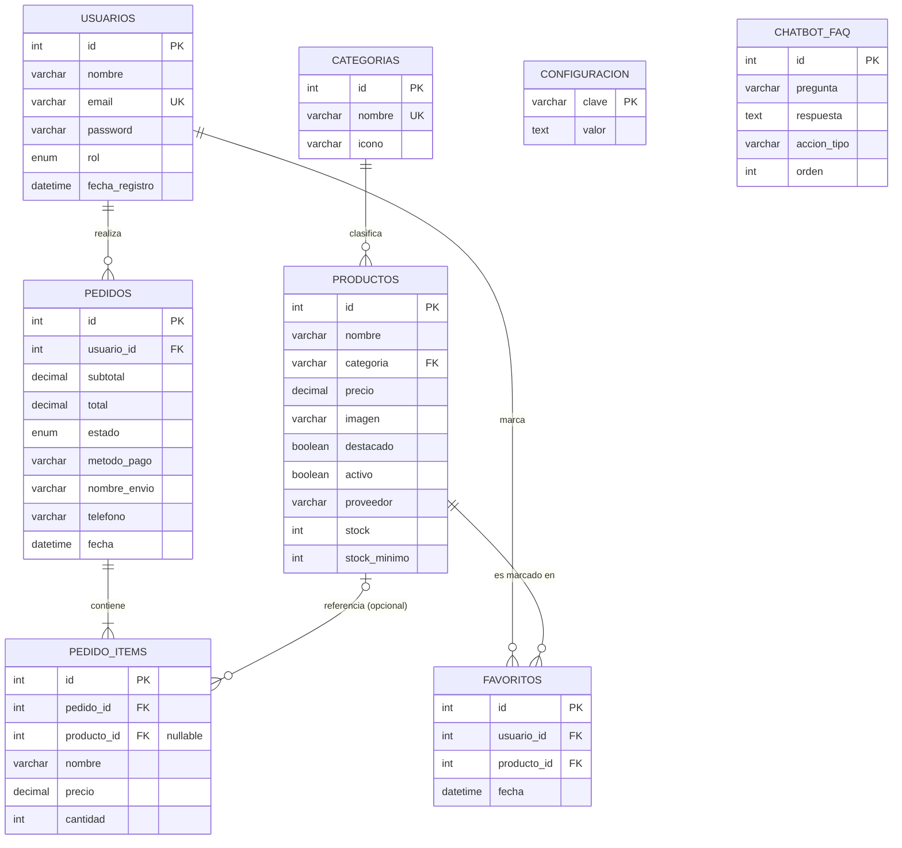

# Diagrama Entidad-Relación y Diccionario de Datos — Dulcería Charles

Generado a partir del esquema real (`dulceria_charles.sql`), después de aplicar las
correcciones de la [auditoría de seguridad y rendimiento](auditorias/auditoria-seguridad-rendimiento-2026-07-30.md)
y de la [revisión de modelado](auditorias/auditoria-modelo-der-2026-07-30.md) del 30 de julio de 2026
(fk_productos_categoria, CHECK constraints, FULLTEXT en productos.nombre, `pedidos.estado NOT NULL`).

## Diagrama

`CATEGORIAS ||--o{ PRODUCTOS` ahora sí está reforzada con una llave foránea real
(`fk_productos_categoria`, `ON UPDATE CASCADE ON DELETE RESTRICT`) — antes de la
corrección era una relación solo lógica, validada únicamente por el código de la
aplicación. `CONFIGURACION` y `CHATBOT_FAQ` son entidades independientes, sin
relación con el resto, a propósito.

## Diccionario de datos

### usuarios

| Campo | Tipo | Restricciones | Descripción |
|---|---|---|---|
| id | INT | PK, AUTO_INCREMENT | Identificador único |
| nombre | VARCHAR(100) | NOT NULL | Nombre completo |
| email | VARCHAR(150) | NOT NULL, UNIQUE | Usado para login |
| password | VARCHAR(255) | NOT NULL | Hash bcrypt (nunca texto plano) |
| rol | ENUM('cliente','admin') | DEFAULT 'cliente' | Nivel de acceso |
| fecha_registro | DATETIME | DEFAULT NOW() | Alta de la cuenta |

### categorias

| Campo | Tipo | Restricciones | Descripción |
|---|---|---|---|
| id | INT | PK, AUTO_INCREMENT | Identificador único |
| nombre | VARCHAR(50) | NOT NULL, UNIQUE | Nombre de la categoría (referenciado por `productos.categoria`) |
| icono | VARCHAR(500) | DEFAULT '🍬' | Emoji o ruta/URL de imagen (ver `js/cat-icon.js`) |

### productos

| Campo | Tipo | Restricciones | Descripción |
|---|---|---|---|
| id | INT | PK, AUTO_INCREMENT | Identificador único |
| nombre | VARCHAR(200) | NOT NULL, FULLTEXT (ft_productos_nombre) | Nombre del producto; búsqueda vía MATCH/AGAINST |
| categoria | VARCHAR(100) | NOT NULL, FK → categorias(nombre) | ON UPDATE CASCADE, ON DELETE RESTRICT |
| precio | DECIMAL(10,2) | NOT NULL, CHECK (precio > 0) | Precio de venta en MXN |
| imagen | VARCHAR(600) | NULL | Ruta relativa o URL |
| destacado | TINYINT(1) | DEFAULT 0 | 1 = aparece en la página principal |
| activo | TINYINT(1) | DEFAULT 1 | 0 = soft delete |
| proveedor | VARCHAR(150) | NULL | Opcional |
| stock | INT | NOT NULL, DEFAULT 20, CHECK (stock >= 0) | Inventario disponible |
| stock_minimo | INT | NOT NULL, DEFAULT 5 | Umbral para alertas de bajo inventario |
| fecha_creacion | DATETIME | DEFAULT NOW() | Alta del producto |

### pedidos

| Campo | Tipo | Restricciones | Descripción |
|---|---|---|---|
| id | INT | PK, AUTO_INCREMENT | Número de pedido |
| usuario_id | INT | NOT NULL, FK → usuarios(id) | Cliente que realizó el pedido |
| subtotal | DECIMAL(10,2) | NOT NULL | Igual a `total` hoy (no hay impuestos/envío/cupones) |
| total | DECIMAL(10,2) | NOT NULL | Monto final a pagar |
| estado | ENUM(...) | NOT NULL, DEFAULT 'pendiente_finalizar' | pendiente_finalizar / pendiente_entregar / entregado / cancelado |
| metodo_pago | VARCHAR(50) | NULL | Efectivo, tarjeta, transferencia |
| nombre_envio | VARCHAR(150) | NULL | Nombre de contacto del pedido |
| telefono | VARCHAR(20) | NULL | Teléfono de contacto |
| fecha | DATETIME | DEFAULT NOW() | Fecha del pedido |

### pedido_items

| Campo | Tipo | Restricciones | Descripción |
|---|---|---|---|
| id | INT | PK, AUTO_INCREMENT | Identificador único |
| pedido_id | INT | NOT NULL, FK → pedidos(id) ON DELETE CASCADE | Pedido al que pertenece |
| producto_id | INT | NULL, FK → productos(id) ON DELETE SET NULL | Referencia informativa (nullable si el producto se elimina) |
| nombre | VARCHAR(200) | NOT NULL | Nombre del producto al momento del pedido (congelado) |
| precio | DECIMAL(10,2) | NOT NULL | Precio unitario al momento del pedido (congelado) |
| cantidad | INT | NOT NULL, CHECK (cantidad > 0) | Unidades pedidas |

### favoritos

| Campo | Tipo | Restricciones | Descripción |
|---|---|---|---|
| id | INT | PK, AUTO_INCREMENT | Identificador único |
| usuario_id | INT | NOT NULL, FK → usuarios(id) ON DELETE CASCADE | Usuario que guardó el favorito |
| producto_id | INT | NOT NULL, FK → productos(id) ON DELETE CASCADE | Producto guardado |
| fecha | DATETIME | DEFAULT NOW() | — |
| (usuario_id, producto_id) | UNIQUE KEY | unique_fav | Evita duplicados |

### configuracion

| Campo | Tipo | Restricciones | Descripción |
|---|---|---|---|
| clave | VARCHAR(100) | PK | Clave del ajuste (ej: `contacto_telefono`) |
| valor | TEXT | NULL | Valor del ajuste |

### chatbot_faq

| Campo | Tipo | Restricciones | Descripción |
|---|---|---|---|
| id | INT | PK, AUTO_INCREMENT | Identificador único |
| pregunta | VARCHAR(150) | NOT NULL | Texto de la pregunta rápida |
| palabras_clave | VARCHAR(500) | DEFAULT '' | Palabras que la disparan en texto libre |
| respuesta | TEXT | NOT NULL | Admite placeholders `{direccion}` `{horario}` `{telefono}` `{email}` |
| accion_tipo | VARCHAR(20) | DEFAULT 'ninguna' | ninguna / link / whatsapp / catalogo / pedidos |
| accion_valor | VARCHAR(300) | DEFAULT '' | Depende de accion_tipo (validado contra esquemas `javascript:`/`data:`) |
| accion_texto | VARCHAR(100) | DEFAULT '' | Texto del botón |
| orden | INT | DEFAULT 0 | Orden de aparición |
| activo | TINYINT(1) | DEFAULT 1 | Soft delete |
