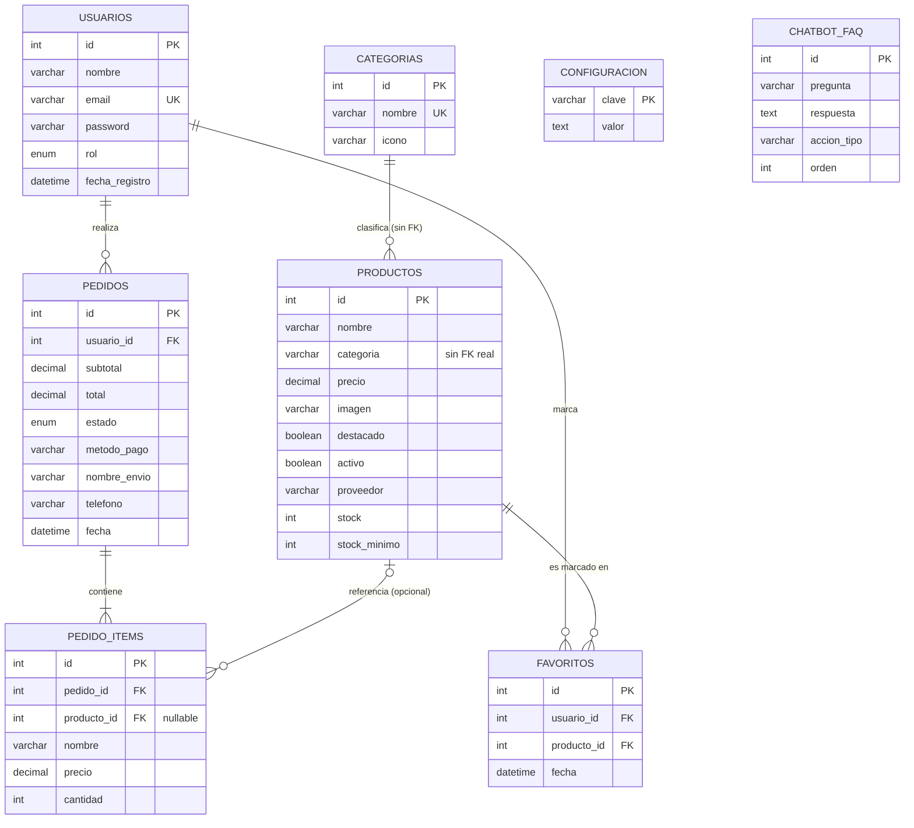

# 🧩 Revisión de modelado — Modelo de datos y DER, Dulcería Charles

Revisión del modelo entidad-relación: entidades, conexiones, cardinalidad, integridad referencial y normalización del esquema `dulceria_charles`.

- **Entidades:** 8
- **Relaciones:** 6 (5 reales + 1 lógica sin FK)
- **Motor:** MySQL 8 / InnoDB
- **Fecha:** 30 jul. 2026

> **Sobre las fuentes usadas:** no llegó un diagrama ni un .sql adjunto en este mensaje. No hacía falta pedirlo aparte: ya se tenía el esquema completo (`dulceria_charles.sql`) y el estado real de la base de datos en ejecución de la auditoría anterior, así que el DER se construyó directamente desde ahí — es la fuente más confiable posible, más incluso que un diagrama dibujado a mano que pudiera haberse desactualizado.

## Calificaciones

| Métrica | Nota |
|---|---|
| Diagrama | 8/10 |
| Conexiones | 8/10 |
| Multiplicidad | 9/10 |
| Organización | 8/10 |
| Normalización | 9/10 |
| Escalabilidad | 6.5/10 |

## Índice

1. [El DER completo](#01-el-diagrama-entidad-relación-completo)
2. [Revisión de entidades](#02-revisión-de-entidades)
3. [Conexiones (PK/FK)](#03-conexiones-claves-primarias-y-foráneas)
4. [Multiplicidad de cada relación](#04-multiplicidad-de-cada-relación)
5. [Integridad referencial](#05-integridad-referencial)
6. [Normalización](#06-normalización)
7. [Nomenclatura y organización](#07-nomenclatura-y-organización)
8. [Escalabilidad del modelo](#08-escalabilidad-del-modelo)
9. [Compatibilidad con el código](#09-compatibilidad-con-el-código-fuente)
10. [Hallazgos por severidad](#10-hallazgos-por-severidad)
11. [Plan de mejora](#11-plan-de-mejora)

---

## 01. El diagrama entidad-relación completo

Reconstruido directamente desde el esquema real. La relación `categoria` es la única que existe en la lógica del sistema pero **no** está reforzada por una llave foránea real — ver [sección de conexiones](#03-conexiones-claves-primarias-y-foráneas).



**Leyenda:** `CATEGORIAS ||--o{ PRODUCTOS` es la única relación lógica sin FK en la base de datos. `CONFIGURACION` y `CHATBOT_FAQ` son entidades independientes, sin relación con el resto — a propósito.

**¿Representa correctamente el sistema?** Sí, con una sola reserva ya señalada (categoría↔producto). **¿Sobra alguna entidad?** No. **¿Falta alguna?** No falta ninguna que el sistema necesite hoy — vale aclarar dos ausencias que son decisiones correctas, no huecos: no hay tabla de "carrito" (el carrito vive en el navegador hasta que se convierte en un `pedido` con `estado='pendiente_finalizar'`, un patrón válido), y no hay tabla de direcciones de envío (el negocio es 100% recolección en tienda, confirmado en los comentarios del propio esquema). **¿Es fácil de leer?** Sí: 8 entidades, jerarquía plana, sin ciclos, sin relaciones cruzadas confusas.

## 02. Revisión de entidades

| Entidad | Propósito | Nombre claro | ¿Redundante? | Veredicto |
|---|---|---|---|---|
| `usuarios` | Cuentas del sistema | Sí | No | Correcta tal cual |
| `categorias` | Categorías del catálogo | Sí | No | Correcta tal cual |
| `productos` | Catálogo | Sí | No | Correcta; falta el FK a categorías |
| `pedidos` | Cabecera de la orden | Sí | Parcial (subtotal=total siempre) | Correcta, ver hallazgo |
| `pedido_items` | Líneas del pedido, con snapshot histórico | Sí | No — redundancia intencional y correcta | Modelo ejemplar |
| `favoritos` | Tabla asociativa usuario↔producto | Sí | No | Modelo ejemplar |
| `configuracion` | Ajustes clave→valor del sitio | Sí | No | Patrón EAV consciente, ver nota |
| `chatbot_faq` | Preguntas frecuentes del chatbot | Sí | No | Correcta tal cual |

Ninguna entidad debería fusionarse ni dividirse. `pedido_items` merece una mención aparte: guarda `nombre` y `precio` duplicados de `productos` a propósito, para que el historial de una compra no cambie si el producto sube de precio después — esto **no** es redundancia mal habida, es el patrón correcto para "congelar" datos históricos en un sistema de pedidos, y de hecho es la señal más clara de que quien diseñó el esquema entendía la diferencia entre normalizar y sobre-normalizar.

## 03. Conexiones (claves primarias y foráneas)

Las 8 entidades usan `id` autoincremental como llave primaria — con una única excepción justificada: `configuracion.clave` (VARCHAR), porque esa tabla es un diccionario clave→valor por diseño, no un catálogo de registros con identidad propia. Todas las llaves foráneas siguen el patrón `<entidad>_id`, coincidiendo en tipo (`INT`) con el `id` al que apuntan.

### USUARIOS → PEDIDOS — FK correcta

- **Representa:** qué usuario hizo cada pedido.
- **Implementación:** `pedidos.usuario_id → usuarios.id`, `ON DELETE` sin regla explícita (equivale a `RESTRICT` en InnoDB) — no se puede borrar un usuario con pedidos.
- **¿Mejorable?** El código ya maneja este caso con un mensaje claro (`usuarios.js` atrapa `ER_ROW_IS_REFERENCED_2`), así que el comportamiento por defecto es el correcto para este sistema: preferible bloquear el borrado a dejar pedidos huérfanos.

### PEDIDOS → PEDIDO_ITEMS — FK correcta

- **Representa:** las líneas/artículos de un pedido.
- **Implementación:** `pedido_items.pedido_id → pedidos.id ON DELETE CASCADE` — correcto: un ítem de pedido no tiene sentido de existir sin su pedido.
- **¿Mejorable?** No. Es el uso de `CASCADE` exactamente donde corresponde.

### PRODUCTOS → PEDIDO_ITEMS — FK correcta

- **Representa:** qué producto del catálogo corresponde a cada línea de pedido (referencia informativa; el nombre/precio ya están congelados en la propia fila).
- **Implementación:** `pedido_items.producto_id → productos.id ON DELETE SET NULL`, columna nullable.
- **¿Mejorable?** No — `SET NULL` es la elección correcta aquí precisamente porque el nombre/precio ya sobreviven aunque el producto se borre. Es un ejemplo de FK "opcional" bien razonado, no un descuido.

### USUARIOS ↔ PRODUCTOS vía FAVORITOS — FK correcta

- **Representa:** qué productos marcó cada usuario como favorito — relación muchos-a-muchos resuelta con tabla intermedia.
- **Implementación:** dos FK (`usuario_id`, `producto_id`), ambas `ON DELETE CASCADE`, más `UNIQUE KEY unique_fav (usuario_id, producto_id)` para impedir el mismo favorito duplicado.
- **¿Mejorable?** No — es el libro de texto de cómo modelar una N:M correctamente: tabla asociativa + llave compuesta única. Nada que corregir aquí.

### CATEGORIAS → PRODUCTOS — ⚠️ Sin FK real

- **Representa:** a qué categoría pertenece cada producto.
- **Implementación actual:** `productos.categoria` es `VARCHAR(100)` que se espera coincida con `categorias.nombre` (que sí es `UNIQUE`) — pero no existe una `FOREIGN KEY` que lo obligue. La relación existe en la lógica del sistema y en el código de la aplicación, no en el esquema.
- **¿Está bien implementada?** No del todo. Es el único punto débil real de esta sección — desarrollado con detalle en [Hallazgos](#10-hallazgos-por-severidad), con el `ALTER TABLE` exacto para corregirlo.

**No hay relaciones rotas, duplicadas ni innecesarias.** Ningún par de tablas tiene dos caminos distintos para relacionarse (lo que causaría ambigüedad), y no existen llaves foráneas "flotantes" que no correspondan a ninguna relación lógica del sistema.

## 04. Multiplicidad de cada relación

| Relación | Cardinalidad | ¿Correcta? | Justificación |
|---|---|---|---|
| usuarios — pedidos | 1 : N | Sí | Un usuario hace cero o muchos pedidos; cada pedido pertenece a exactamente un usuario. FK del lado correcto (en la tabla "muchos"). |
| pedidos — pedido_items | 1 : N | Sí | Un pedido tiene una o varias líneas (el backend rechaza carritos vacíos); cada línea es de un solo pedido. |
| productos — pedido_items | 1 : N (opcional) | Sí | Un producto puede aparecer en muchas líneas de pedido a lo largo del tiempo; la FK es nullable porque el producto puede eliminarse después. |
| usuarios — productos | N : M | Sí | Resuelta correctamente vía `favoritos` — ni usuarios ni productos tienen una FK directa entre sí, que sería imposible de expresar en un modelo relacional sin tabla intermedia. |
| categorias — productos | 1 : N | Correcta en lógica, no en esquema | La cardinalidad conceptual (una categoría, muchos productos) es la correcta — el problema no es la multiplicidad, es que no está reforzada con FK. |

**¿Alguna relación debería ser 1:1?** No se identificó ningún caso — no hay dos entidades en este modelo cuya relación 1:1 tuviera sentido separar en dos tablas. **¿Falta alguna tabla intermedia?** No — la única N:M del sistema (usuarios↔productos vía favoritos) ya está resuelta correctamente. **¿Hay multiplicidad innecesaria?** No se encontró ninguna relación sobre-modelada (por ejemplo, una N:M donde bastaría una 1:N).

## 05. Integridad referencial

Se verificaron las 5 llaves foráneas reales contra la base de datos en ejecución (no solo contra el .sql) — ninguna apunta a una tabla o columna inexistente, y no se encontraron registros huérfanos en ninguna tabla con relaciones.

| FK | ON DELETE | ¿Apunta correctamente? | ¿Huérfanos encontrados? |
|---|---|---|---|
| `pedidos.usuario_id` | RESTRICT (implícito) | Sí | No |
| `pedido_items.pedido_id` | CASCADE | Sí | No |
| `pedido_items.producto_id` | SET NULL | Sí | No |
| `favoritos.usuario_id` | CASCADE | Sí | No |
| `favoritos.producto_id` | CASCADE | Sí | No |

No hay ciclos en el grafo de relaciones (ninguna cadena de FKs vuelve sobre sí misma), lo cual es deseable: los ciclos en un modelo relacional casi siempre complican los borrados en cascada y son señal de un diseño confuso. El único punto de integridad que **no** está cubierto a nivel de base de datos es `productos.categoria`, ya detallado arriba — ahí sí podría, en teoría, existir un producto con una categoría que ya no existe, si algo se salta la validación de la aplicación.

## 06. Normalización

- **1FN** — cumplida en las 8 tablas: cada columna guarda un solo valor atómico, no hay listas ni valores repetidos dentro de una celda.
- **2FN** — cumplida: todas las llaves primarias son de una sola columna (o clave natural en `configuracion`), así que no hay dependencias parciales posibles por definición.
- **3FN** — cumplida en el sentido estricto en todas las tablas *excepto* la duplicación intencional de `nombre`/`precio` en `pedido_items` — que técnicamente depende de `productos.id` y no solo de la llave de `pedido_items`. Esto se señala explícitamente porque una revisión formal de 3FN lo marcaría, pero es **desnormalización deliberada y correcta** para preservar el historial de precios — el patrón estándar en cualquier sistema de e-commerce/facturación real.

La única nota de diseño (no una violación de forma normal) es `configuracion`: un patrón EAV, cumple 3FN técnicamente (el valor depende enteramente de la clave), pero sacrifica el tipado y la validación por columna que tendría una tabla de columnas fijas. Aceptable dado su volumen (9 filas, solo el admin escribe) — no se recomienda cambiarlo salvo que la cantidad de ajustes crezca mucho.

## 07. Nomenclatura y organización

| Elemento | Estándar observado | Consistente |
|---|---|---|
| Tablas | snake_case, español, plural | Sí |
| Columnas | snake_case, español | Sí |
| Llaves primarias | `id` (excepción justificada: `configuracion.clave`) | Sí |
| Llaves foráneas | `<entidad>_id` | Sí |
| Índices | `idx_<columna>` | Sí |
| Restricciones FK | Nombres autogenerados por MySQL (`tabla_ibfk_N`) | Mejorable |

No hace falta proponer un estándar nuevo — el que ya se sigue es coherente y profesional. El único ajuste recomendable es nombrar explícitamente las restricciones FK (`CONSTRAINT fk_pedidos_usuarios FOREIGN KEY...`) la próxima vez que se toque el esquema, para que los mensajes de error de integridad referencial sean legibles de un vistazo.

## 08. Escalabilidad del modelo

Separando dos preguntas distintas: ¿el **modelo relacional en sí** permite crecer sin rediseñar, y la **implementación actual** (consultas, índices) aguanta más volumen? La primera respuesta es más optimista que la segunda.

**Agregar módulos nuevos:** sencillo. Por ejemplo, un futuro módulo de reseñas de producto solo necesitaría una tabla `resenas(id, usuario_id FK, producto_id FK, calificacion, comentario)` — se conecta limpio sin tocar ninguna tabla existente. Lo mismo aplica para cupones de descuento, notificaciones, o un sistema de puntos de lealtad: el modelo actual no tiene ninguna decisión que bloquee esas extensiones.

**Miles de usuarios / millones de registros:** aquí es donde ya se identificó el límite real en la auditoría anterior — no es un problema del *modelo*, es que ningún endpoint de listado (`GET /api/productos`, `/api/pedidos`, `/api/usuarios`) pagina resultados. El modelo soporta perfectamente millones de filas; las consultas actuales las traerían todas de una sola vez.

**Mejoras sugeridas:** paginación (ya detallada en la auditoría de rendimiento), y considerar particionar `pedidos` por fecha si el histórico creciera mucho en unos años — no es necesario hoy.

## 09. Compatibilidad con el código fuente

Ya verificado en la auditoría técnica previa de esta misma revisión, cruzando cada consulta de los 8 archivos en `backend/routes/` contra el esquema real:

- Las 8 tablas que el código consulta existen en la base de datos, con exactamente los nombres que el código espera.
- No se encontró ninguna columna referenciada en una consulta que no exista en su tabla.
- No hay consultas apuntando a tablas o columnas que ya no existen (sin restos de un "cupones" u otra tabla eliminada, según confirma el propio comentario del esquema).
- No hay ninguna relación que el código dé por hecha (vía JOIN) que no esté respaldada por una FK real o por una columna que efectivamente exista — *excepto*, otra vez, `productos.categoria`, donde el código sí hace su propio JOIN lógico (una consulta separada a `categorias` para validar) precisamente porque sabe que la base de datos no se lo garantiza.

## 10. Hallazgos por severidad

Del modelo de datos en sí (no se repiten aquí los hallazgos de seguridad/operación del informe anterior, como el usuario root de MySQL — ese vive en la auditoría técnica, este es el informe de modelado).

### 🟠 Alto — productos.categoria sin llave foránea

- **Por qué es un problema:** es la única relación del modelo que no se puede validar mirando solo el esquema — hay que confiar en que el código de la aplicación siempre la revise, en todos los caminos de escritura, para siempre.
- **Consecuencia:** un producto con una categoría "fantasma" (que no existe en `categorias`) no rompería nada de inmediato, pero desaparecería silenciosamente de cualquier filtro por categoría en el catálogo — un bug difícil de rastrear porque no lanza ningún error.
- **Solución:**
  ```sql
  ALTER TABLE productos
    ADD CONSTRAINT fk_productos_categoria
    FOREIGN KEY (categoria) REFERENCES categorias(nombre)
    ON UPDATE CASCADE ON DELETE RESTRICT;
  ```

### 🟢 Bajo — Restricciones FK sin nombre explícito

- **Por qué es un problema:** cosmético, no funcional — pero un mensaje de error como `Cannot delete... foreign key constraint fails (productos_ibfk_1)` obliga a ir a buscar qué relación es esa.
- **Solución:** nombrar cada FK al crearla: `CONSTRAINT fk_favoritos_usuario FOREIGN KEY (usuario_id) REFERENCES usuarios(id)`.

### 🟢 Bajo — configuracion como patrón EAV

- **Por qué se señala:** no es un error — es una nota de diseño. Un patrón clave→valor sacrifica el tipado fuerte que tendría una tabla de columnas fijas (ej. `contacto_telefono VARCHAR(20)` en vez de una fila más en el diccionario).
- **Cuándo importaría:** solo si la cantidad de ajustes de configuración creciera mucho (decenas de claves con distintos tipos/validaciones) — a las 9 claves actuales no vale la pena migrarlo.

No se encontró ningún hallazgo 🔴 crítico ni ninguno adicional 🟡 medio específico del *modelado* — los de esa severidad en el sistema completo (JWT_SECRET, contraseña mínima, etc.) son de seguridad de aplicación, no de diseño de datos, y ya están documentados en la auditoría técnica anterior.

## 11. Plan de mejora

### Prioridad alta

- **FK real en productos.categoria** — un solo `ALTER TABLE`; cierra el único hueco de integridad del modelo.

### Prioridad media

- **Paginar los listados grandes** — no es un cambio del modelo, sino de cómo se consulta — necesario antes de escalar en volumen de datos.

### Prioridad baja

- **Nombrar las FK explícitamente** — solo mejora la legibilidad de errores futuros.
- **Mantener configuracion como está** — revisar de nuevo solo si crece mucho la cantidad de claves.

---

**Recomendaciones finales:** este es, estructuralmente, un modelo relacional bien pensado para el tamaño del proyecto — las relaciones N:M y las decisiones de desnormalización histórica (`pedido_items`) están resueltas como lo haría un sistema de e-commerce real, no como un ejercicio académico. El único cambio que de verdad vale la pena priorizar es la llave foránea de `categoria`; todo lo demás es refinamiento, no corrección de errores.

*Metodología: reconstrucción del DER a partir de `dulceria_charles.sql` y del estado real de la base de datos (`information_schema`: llaves foráneas, índices, nulabilidad), verificado en la misma sesión de auditoría técnica.*

*Versión HTML con estilo original: [auditoria-modelo-der-2026-07-30.html](auditoria-modelo-der-2026-07-30.html)*
